# Backtest orchestration — categorical model

> Model-first (FRAMEWORK §2/§4). Intended specification for this component; the
> code realises it (see IMPLEMENTATION.md). Source of record:
> `src/analysis_engine.py`. Deep rationale (Wilson interval, risk_reward_score,
> suitability thresholds): see [system_architecture.md](../system_architecture.md) §4.

## 1. Overview
The orchestrator: runs the multi-event backtest per ticker across
`data-ingestion` and `markov-engine`, aggregates results with a Wilson
confidence interval, ranks tickers, classifies suitability, and writes every
output artifact (`report.md`, `ranking.csv`, charts, `interface/index.html`).
Owns the system's one browser-facing `Trm`.

## 2. Why
This is where the system's real partiality lives at the *aggregate* level:
`n_events` can be meaningfully smaller than `MAX_BACKTEST_EVENTS` because
degenerate fits are silently skipped, and the ranking formula explicitly
discounts by the Wilson lower bound specifically so a thin sample can't
outrank a well-supported one. Both are compositional facts worth stating
once, formally, rather than re-deriving from reading the loop.

## 3. Core category

```mermaid
graph LR
    HIST["history (from data-ingestion)"]
    RESULT["per-ticker result dict"]
    RANKED["ranked DataFrame"]
    SUIT["suitability labels"]
    OUT["output/ artifacts"]
    IFACE["interface/index.html"]
    BROWSER["browser (external Loc)"]

    HIST -->|"analyze_ticker (partial: usable events)"| RESULT
    RESULT -->|"rank (total)"| RANKED
    RANKED -->|"classify_suitability (total)"| SUIT
    RANKED -->|"write_report, write_interface (total)"| OUT
    OUT -->|"write_interface (Trm)"| IFACE
    IFACE -->|"page load"| BROWSER

    style HIST fill:#4f8cf7,color:#fff
    style RESULT fill:#4f8cf7,color:#fff
    style RANKED fill:#4f8cf7,color:#fff
    style SUIT fill:#4f8cf7,color:#fff
    style OUT fill:#f7c04f,color:#000
    style IFACE fill:#f7c04f,color:#000
    style BROWSER fill:#f77f7f,color:#fff
```

## 4. Morphism table
| Morphism | Signature | Partiality | Semantics |
| --- | --- | --- | --- |
| `_usable_event_indices` | `(history, events) → list[int]` | Total | needs `MIN_FIT_HISTORY` (300 days) pre-event, not just the search window |
| `_entry_exit_search` | `(history, ex_idx, dividend, cum_close, ...) → dict` | Total | full entry+exit Monte Carlo search for one event, both models |
| `analyze_ticker` | `ticker → dict` | Partial | skips events whose fit is `DegenerateFitError`; `n_events` reflects the actual usable sample |
| `wilson_interval` | `(successes, n, z) → (lo, hi)` | Total | 95% Wilson score interval; chosen over naive ± for small-`n` coverage |
| `rank` | `list[dict] → DataFrame` | Total | orders by `risk_reward_score = mean_return% × wilson_lower_bound ÷ mean_hold_days` |
| `classify_suitability` | `DataFrame → dict[str, dict]` | Total | `Not recommended`/`Conservative`/`Aggressive`/`Balanced`, thresholds relative to the ticker set's own median |
| `build_interface_records` | `(results, df, ...) → list[dict]` | Total | stamps `isTopN` from `TOP_N` |
| `write_interface` | `list[dict] → interface/index.html` | Total | the system's browser-facing `Trm` |
| `write_report` | `(df, suitability) → report.md` | Total | includes the Quick-picks table, same function as `classify_suitability` so CSV/report/interface agree |
| `plot_paths` | `(ticker, history, ex_idx, result) → PNG` | Total | per-ticker detail chart |
| `plot_comparison_chart` | `list[dict] → PNG` | Total | overlays actual prices for the top-N only, indexed to 100 |
| `main` | `() → ()` | Total | ranks **before** charting, so the comparison chart knows the true top-N |

## 5. Functors
**Per-ticker backtest pipeline**: `history → analyze_ticker →
{_usable_event_indices → _entry_exit_search}* → result dict`, aggregated with
`wilson_interval`. **Output pipeline**: `ranked DataFrame →
{write_report, write_interface, plot_comparison_chart}` — a fan-out functor,
not a chain; all three are deduced from the same `rank`/`classify_suitability`
output so they can't disagree (`system_architecture.md` §5).

## 6. Composition rules
1. `invariant: risk_reward_score = mean_return_per_cycle% × wilson_lower_bound(hit_rate) ÷ mean_hold_days`
   — discounted by the interval's lower bound, not the raw hit rate.
2. `invariant: n_events ≤ MAX_BACKTEST_EVENTS (50)`, and can be smaller —
   degenerate-fit events are skipped, not padded with a guess.
3. `deduction: isTopN = rank ≤ TOP_N`, recomputed fresh every run from
   `risk_reward_score` — no hardcoded ticker list (session 8 fix).
4. `invariant: classify_suitability's labels are independent of the
   conservative/recent model toggle` — answers "which stock suits your risk
   tolerance," not "which calculation method was used."
5. `deduction: write_report's Quick-picks table and the interface's ranked
   list both call classify_suitability, never a separate copy` — one source
   of truth, per `system_architecture.md` §5.

## 7. Atoms owned (FRAMEWORK §4)
**Trn** — the morphism table above; realising code `src/analysis_engine.py`.
**Loc** — `local-python` for everything up through `write_interface`; `browser` for the interface's rendering.
**Trm** — `write_interface`: `local-python → browser`, file-mediated, not live (see `docs/architecture-map.md`).
**Placements (§4.2)** — none beyond the one `Trm` above.

## 8. Bridges to other components (ports)
| Boundary morphism | Signature | Stored? | Semantics |
| --- | --- | --- | --- |
| `history` | `data-ingestion → backtest-orchestration` | No (per-run) | consumed directly in `analyze_ticker` |
| `MarkovModel`/`DegenerateFitError` | `markov-engine → backtest-orchestration` | No (per-event) | `analyze_ticker` catches `DegenerateFitError` per event |

## 9. Coherence notes
Law 1 (placement honesty) is actively enforced by design, not just
accidentally satisfied: the interface's 60-second auto-refresh has a visible
countdown and an explanatory guide panel specifically so it doesn't imply
live data when the `Trm` is file-mediated and one-shot per analysis run
(`CLAUDE.md`, session 7; `system_architecture.md` §5). No law is FAILing.
