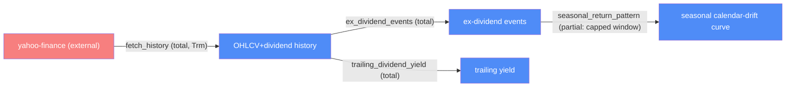

# Data ingestion — categorical model

> Model-first (FRAMEWORK §2/§4). Intended specification for this component; the
> code realises it (see IMPLEMENTATION.md). Source of record: `src/data_io.py`.
> Deep rationale (Q_ratio, calendar-drift window capping): see
> [system_architecture.md](../system_architecture.md) §1, §3.

## 1. Overview
Fetches real OHLCV + dividend history from Yahoo Finance and derives the
ex-dividend event table, trailing yield, and the per-ticker seasonal
calendar-drift curve every other component consumes.

## 2. Why
This is the system's one real external `Trm` and the sole source of price
data — `CLAUDE.md`'s "no fabricated financial data" constraint is a property
of this component's boundary, not the whole codebase's, so it's worth being
explicit about exactly where that guarantee is enforced.

## 3. Core category

## 4. Morphism table
| Morphism | Signature | Partiality | Semantics |
| --- | --- | --- | --- |
| `fetch_history` | `(ticker, period) → DataFrame` | Total (raises on API failure, never guesses) | the only source of price/dividend numbers in this codebase |
| `ex_dividend_events` | `DataFrame → DataFrame` | Total | records `cum_close`, `ex_close`, drop, `Q_ratio = drop/dividend` |
| `trailing_dividend_yield` | `DataFrame → float` | Total | trailing-12mo dividends ÷ latest close |
| `seasonal_return_pattern` | `(history, event_indices, ...) → drift curve` | Partial | window capped to `event_gap // 2 - 1` (floor 3 days) per ticker; days beyond the safe window get zero drift, not a contaminated estimate |

## 5. Functors
**Calendar-drift pipeline**: `history → ex_dividend_events → (per-event
aligned cumulative-log-return curves) → averaged seasonal drift`. Explicitly
an event-study average, not a CAPM/market-model abnormal return — no
benchmark index is subtracted (`system_architecture.md` §3).

## 6. Composition rules
1. `constraint: every Dat traces to fetch_history — no hand-typed or
   LLM-guessed price/dividend value anywhere` — the hard constraint from
   `CLAUDE.md`.
2. `deduction: seasonal window = event_gap // 2 - 1, floor 3 days` — prevents
   neighboring-event contamination for monthly payers (AGNC/O/STAG, ~21
   trading-day gaps) while still using the full 15/40-day window for
   quarterly payers (TTE, ~62-day gap). See `system_architecture.md` §3 for
   the specific bug this fixed.

## 7. Atoms owned (FRAMEWORK §4)
**Trn** — the morphism table above; realising code `src/data_io.py`.
**Loc** — `local-python` (this component runs entirely inside the one Python process).
**Trm** — `fetch_history`: `yahoo-finance → local-python`, the system's one real external transmission.
**Placements (§4.2)** — none.

## 8. Bridges to other components (ports)
| Boundary morphism | Signature | Stored? | Semantics |
| --- | --- | --- | --- |
| `fetch_history` result | `data-ingestion → markov-engine, backtest-orchestration` | Yes, per-run (not cached across runs) | both downstream components read the same in-memory `DataFrame` for one `analyze_ticker` call |

## 9. Coherence notes
Law 2 (transmission well-typing) is the law this component exists to satisfy:
every downstream number's provenance traces back through exactly one `Trm`.
No law is currently FAILing.
