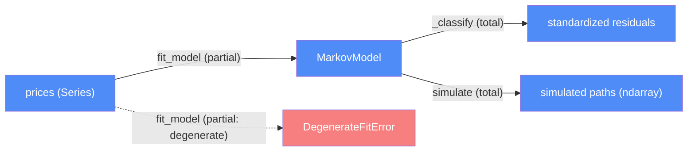

# Markov engine — categorical model

> Model-first (FRAMEWORK §2/§4). Intended specification for this component; the
> code realises it (see IMPLEMENTATION.md). Source of record: `src/markov.py`.
> Deep rationale (EGARCH vs GARCH, degenerate-fit numerics, antithetic
> variates): see [system_architecture.md](../system_architecture.md) §2.

## 1. Overview
Fits an EGARCH(1,1,1)-filtered regime-bootstrap model to a ticker's daily log
returns, then Monte Carlo-simulates forward price paths from it, applying the
data-ingestion component's calendar-drift curve as a separate deterministic
term.

## 2. Why
This is the component with the most partiality in the whole codebase — a fit
can legitimately fail (`DegenerateFitError`), and three numerical safety nets
exist specifically because the optimizer's own success signal doesn't catch
the failure mode found in session 6. Naming that partiality explicitly is
exactly what stops it from being "an edge case nobody wrote down."

## 3. Core category

## 4. Morphism table
| Morphism | Signature | Partiality | Semantics |
| --- | --- | --- | --- |
| `fit_model` | `(prices, label, dist) → MarkovModel` | Partial | raises `DegenerateFitError` after one Normal-distribution retry if `_is_degenerate` |
| `_is_degenerate` | `(alpha, gamma, beta) → bool` | Total | rejects `\|alpha\|>20`, `\|gamma\|>20`, `\|beta\|≥1` |
| `_log_returns` | `Series → ndarray` | Total | |
| `_classify` | `(values, edges) → ndarray` | Total | buckets standardized residuals into 5 quantile states |
| `current_state` | `MarkovModel → int` | Total | |
| `simulate` | `(model, start_price, start_state, n_days) → ndarray` | Total | rolls the EGARCH log-variance recursion forward; antithetic variates; residuals clipped `±10`, log-variance clipped `±4` |
| `apply_calendar_drift` | `(paths, per_step_drift) → ndarray` | Total | multiplies data-ingestion's deterministic seasonal term in — kept separate from the random EGARCH process on purpose |

## 5. Functors
**Fit-then-simulate pipeline**: `prices → fit_model → MarkovModel → simulate
→ paths`, with `apply_calendar_drift` composed afterward as a deterministic
post-processing step, not part of the random process itself (`system_architecture.md` §2).

## 6. Composition rules
1. `constraint: mean="Zero"` — the EGARCH mean equation is fixed; no general
   directional drift is modeled, deliberately, to avoid conflating a noisy
   naive-drift estimate with the volatility model.
2. `invariant: a fit is rejected if |alpha|>20, |gamma|>20, or |beta|≥1` —
   `_is_degenerate`; one retry with a Normal distribution, then
   `DegenerateFitError`.
3. `invariant: standardized residuals clipped to ±10 before bootstrapping` —
   numerical safety net, not a modeling choice about real market behavior.
4. `invariant: log-variance clipped to a ±4 band around a data-grounded
   reference` — same purpose as rule 3, at the recursion level.
5. `deduction: E|z| estimated empirically from the fit's own residuals` —
   not assumed from a parametric distribution.

## 7. Atoms owned (FRAMEWORK §4)
**Trn** — the morphism table above; realising code `src/markov.py`.
**Loc** — `local-python`; pure computation, no I/O of its own.
**Trm** — none; consumes `data-ingestion`'s `Dat` in-process.
**Placements (§4.2)** — none.

## 8. Bridges to other components (ports)
| Boundary morphism | Signature | Stored? | Semantics |
| --- | --- | --- | --- |
| `MarkovModel`, `DegenerateFitError` | `markov-engine → backtest-orchestration` | Yes, per-event | `analyze_ticker` calls `fit_model`/`simulate` directly and catches `DegenerateFitError` to skip that event, per `docs/IMPLEMENTATION.md`'s shared-objects table |

## 9. Coherence notes
No §4.5 law FAILing. Composition rules 2–4 are the three numerical safety
nets from `system_architecture.md`'s session-6 debugging trail — if any of
these three is ever loosened, re-run the specific degenerate case documented
there (`ν≈2` Student-t fit → `alpha≈749`) before shipping.
